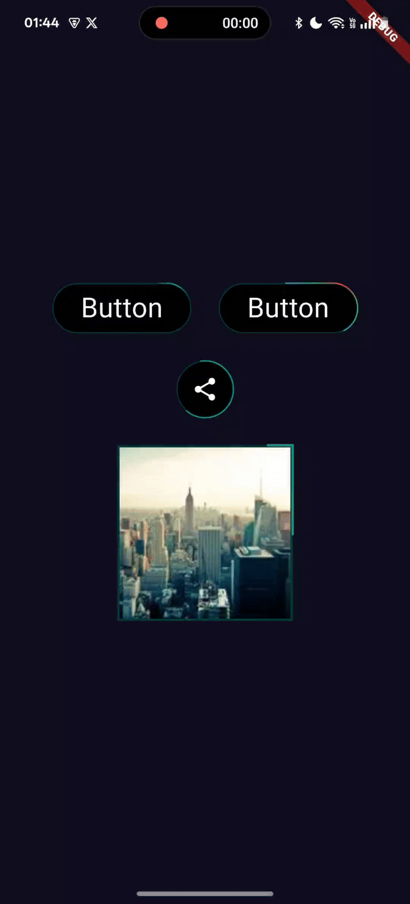

# Flutter Animate Border

## Dart v3.7.0 and beyond

- Start migrating to take advantage of latest dart features

## Screenshot

## FEATURES

- [x] Controller to start and stop the animating border line.
- [x] Add Gradient to the animating border line.
- [x] Border Radius for the animating border line.
- [x] Padding between widget and the animating border line.
- [x] Border thickness control
- [x] Freeze the borderline <- new

## UPCOMING

- [ ] Add progress bar support
- [ ] Support custom shapes of container.
- [ ] More Customizations
